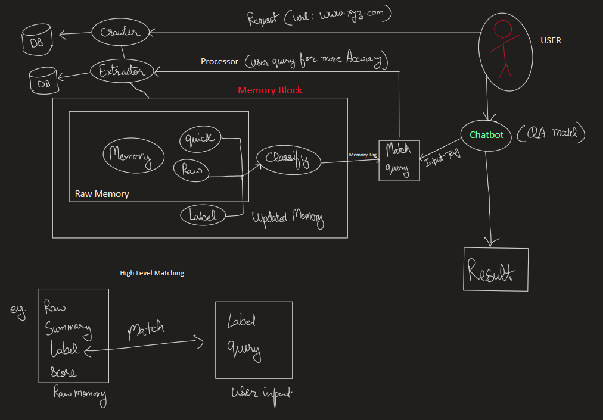

# AI webbot

prototype:

## File Structure
- database                  - data
- monitoring & observibily  - logger
- core                      - modules

- main                      - cli.py 

## How to Use

- python cli.py crawl https://botpenguin.com
- python cli.py process "What chatbot pricing options exist?"
- python cli.py summarize
- python cli.py ask "How much does the chatbot cost?"