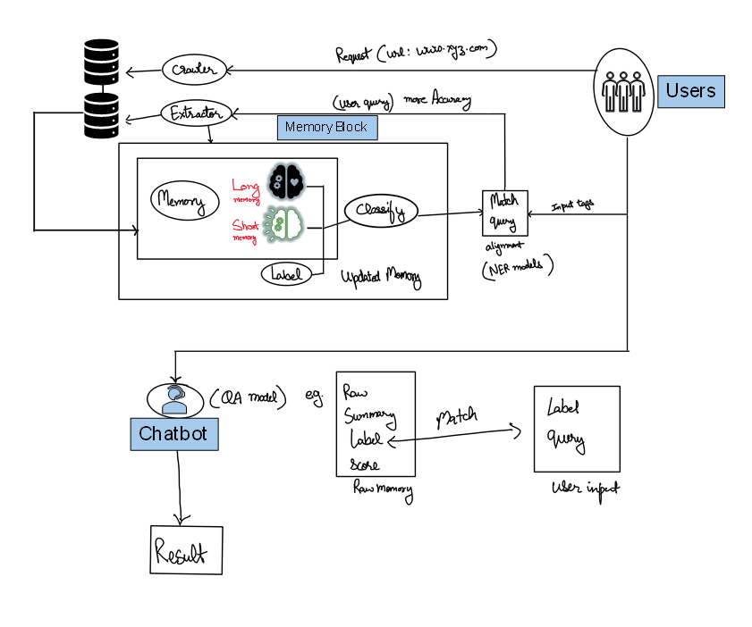

# AI webbot

System prototype:

## File Structure
- database                  - data
- monitoring                - logger
- core                      - modules

- main                      - cli.py 

## How to Use

- python cli.py crawl https://botpenguin.com
- python cli.py process "What chatbot pricing options exist?"
- python cli.py memory
- python cli.py ask "How much does the chatbot cost?" - "update soon"

### it use SFT which is slow and inefficient.
- will try Reinforcement Learning for Better Reasoning based LRM (arXiv:2501.09686v3)
